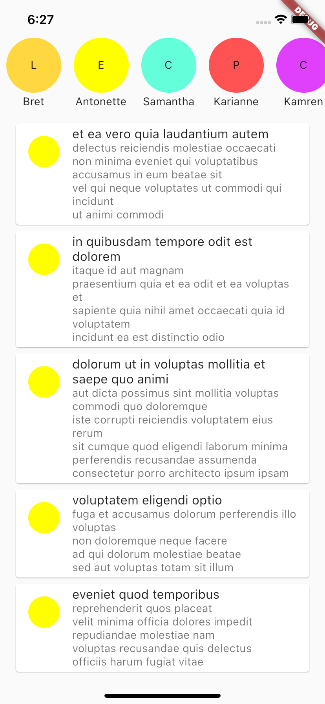

# Clean Flutter

It is a Clean Arcihtecture, TDD (Test Driven Development) and Feature-First Structure implementation example in Flutter.

    <table>
        <tr>
            <td style="text-align: center">
                    
            </td>              
        </tr>
    </table>

### You can learn the followings:

- TDD
- Clean Architecture
- State Management with Bloc
- DI (Dependency Injection) with get_it
- Feature-First Architecture
- Unit Testing
- Mocks and Stubs
- Dio (Http requests)
- Exception handling, Multi Response
